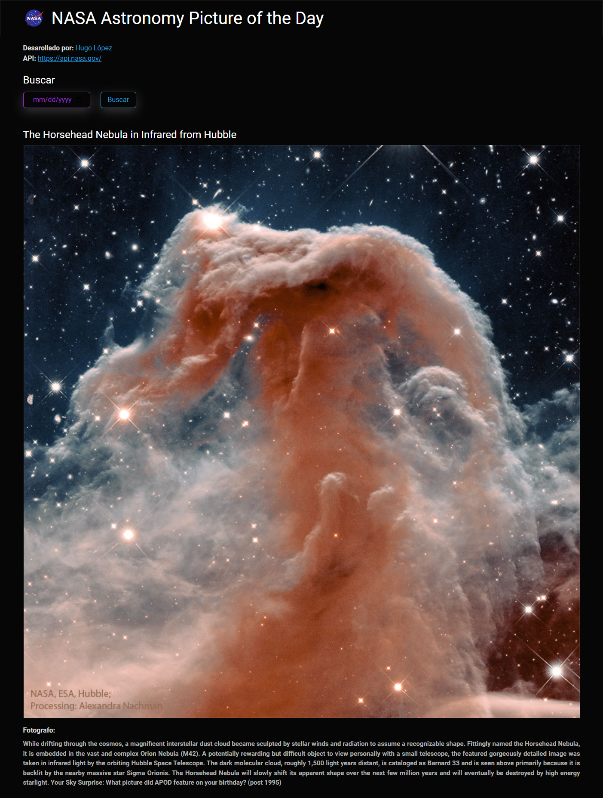
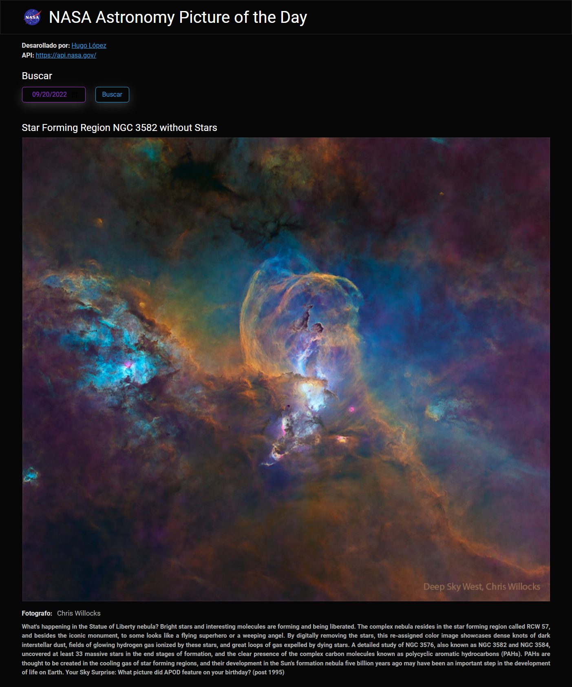

# React-Nasa-APOD (NASA Astronomy Picture of the Day) 🛰

## Table of contents

- [Overview](#overview)
  - [The challenge](#the-challenge)
  - [NASA APIs](#nasa-apis)
  - [How to interact (website)](#how-to-interact-with-he-website)
  - [Screenshot](#screenshot)
  - [Links](#links)
- [My process](#my-process)
  - [Built with](#built-with)
  - [Skills](#skills)
- [Author](#author)

## Overview

### The challenge

1. Create a **functional React page** where the user can consult the NASA Astronomy Picture of the Day, by consuming the "NASA APIs"

2. The page should have first section with the NASA logo and the title "NASA Astronomy Picture of the Day"

3. A second section under the first one should have the next information:
    - Desarollado por (Develop by:)
    - NASA APIs link

4. A third section under the last one should be a searcher (date input) that allows to select the date of the NASA Astronomy Picture of the Day the user want to visualize
    - The selection must be restricted from today (current date) backwards (previous dates)

5. The last section should contain:
    - Name of the selected NASA Astronomy Picture of the Day (current day when entering the page)
    - The image of the selected NASA Astronomy Picture of the Day (current day when entering the page)
    - Photographer's name
    - Description

### NASA APIs

- [Overview](https://api.nasa.gov/)

### How to interact with he website

1. Entering the page you will see all the sections that have been already mentioned in the challenge description.

2. By clicking on the name "Hugo Lopez", located in the second section, you will be redirected to the next github profile: [https://github.com/Alelsito](https://github.com/Alelsito).

3. By clicking on the Api's link you will be redirected to the NASA APIs page [https://api.nasa.gov/](https://api.nasa.gov/).

4. In the third section you will visualize a date input, without introducing any date, you will se the last section of the page, wich contains the name of the NASA Astronomy Picture of the Day (*current date*), the image of it, the photographer's name and the description.

    - If you introduce any other date, the last section will be refresh with the corresponding info of the NASA Astronomy Picture of the Day of it.
    * The selection is restricted from today (current date) backwards (previous dates)

### Screenshot

1. **Entering the page**

2. **Date search (example)**

### Links

- GitHub Repository: [react-nasa-apod-github](https://github.com/Alelsito/react-nasa-apod)
- Live Site URL(Netlify): [react-ntl-nasa-apod-netlify](https://react-ntl-nasa-apod.netlify.app/)

## My process

### Built with

- HTML
- JS
- CSS
- [React](https://reactjs.org/) - JS library
- [Vite](https://vitejs.dev/) - Build frontend tool (in this case for React)
- [Bootswatch](https://bootswatch.com/) - For styles
- [Cdnjs](https://cdnjs.com/libraries/bootswatch) - To use Bootswatch

### Skills

- React library
- React Hooks:
    - [useState](https://reactjs.org/docs/hooks-state.html)
    - [useEffect](https://reactjs.org/docs/hooks-effect.html)
- APIs
- [Axios](https://axios-http.com/docs/intro)
- [NodeJS](https://nodejs.org/en/)
- [npm](https://www.npmjs.com/)
- Handling forms and events

## Author

- Github - [@Alelsito](https://github.com/Alelsito)